# Isaac Ahmed — Dossier de spécification, de modélisation et de documentation

**Projet** : Isaac Ahmed — agent conversationnel d'accueil multimodal pour data center
**Entreprise** : ST DIGITAL, Libreville, Gabon
**Stagiaire** : MENGUE ME NANG Tatille Ambre — Master 1 Développement
**Tutrice** : MEBANG MBOUROUNOU Aminta
**Date de rédaction** : 20 août 2026

## Sources et méthode de lecture

Ce document est construit à partir de trois sources, clairement distinguées tout au long du texte :

| Symbole | Source | Nature |
|---|---|---|
| 📄 Doc | `Fiche_de_stage_Isaac_Ahmed.docx` et `Recueil_de_procedures_Isaac_Ahmed.docx` | Ce qui est écrit noir sur blanc dans les documents officiels |
| 💻 Code | Le dépôt `accueil-app` (React) tel qu'il existe aujourd'hui | Ce qui est réellement implémenté, observé en lisant les fichiers |
| 💡 Proposition | Recommandation de la personne rédigeant ce dossier | Ce qui n'est écrit nulle part et qu'il faudra faire valider par la tutrice avant de le considérer comme acquis |

**Constat préalable important** : la Fiche de stage est un document de cadrage (contexte, objectifs, périmètre, livrables, planning, méthodologie d'encadrement) — elle décrit *quoi construire et pourquoi*, à un niveau assez général. Le Recueil de procédures, en revanche, **ne contient aucune spécification fonctionnelle de l'application** : c'est un guide de méthode de travail pour la stagiaire (journal de bord, gestion Git, gestion des secrets, rituels, gestion de blocage, tests, documentation, clôture de stage). Il est utilisé ici uniquement comme source de contraintes de méthode et de cas de test attendus (PR-09), pas comme source de fonctionnalités.

Conséquence directe : les documents ne détaillent ni les champs exacts d'un formulaire, ni le contenu d'un QR code, ni la structure d'une base de données. Ce dossier reprend donc rigoureusement le niveau de détail des documents pour tout ce qui est marqué 📄, complète avec ce qui est observé dans le code (💻), et signale explicitement chaque fois qu'il propose un niveau de détail supplémentaire (💡) — c'est précisément le travail attendu du livrable *« État de l'art et spécifications fonctionnelles »* dû en fin de semaine 2 selon la Fiche de stage.

---

# PARTIE A — Analyse du besoin

## A.1 Contexte 📄

ST DIGITAL exploite des data centers recevant régulièrement des visiteurs (clients, prospects, partenaires, auditeurs, délégations institutionnelles). Chaque visite fait l'objet d'un rendez-vous préalable et d'une carte d'invitation. Aujourd'hui, l'accueil mobilise systématiquement une personne pour identifier l'arrivant, retrouver l'objet de sa venue et prévenir la personne qui doit le recevoir.

## A.2 Problématique 📄

Comment concevoir une architecture logicielle permettant d'ajouter progressivement des modalités d'interaction (texte, puis audio, puis vidéo) et de basculer d'une inférence en API cloud vers une inférence hébergée en interne, sans réécrire le cœur applicatif ? Cette contrainte vient de l'absence actuelle d'infrastructure GPU chez ST DIGITAL et impose un découplage entre le domaine métier et les technologies d'exécution.

**Ligne rouge de conception 📄** : *Isaac accueille et notifie — il n'autorise pas un accès. Aucune décision de sécurité physique ne doit dépendre de l'agent.* Cette règle est structurante et doit apparaître explicitement dans le dossier de conception.

## A.3 Objectifs 📄

- **Techniques** : architecture modulaire découplant noyau conversationnel / modalités d'E-S / fournisseur d'inférence ; socle fonctionnel (rendez-vous, QR code, notification de l'hôte) ; module conversationnel textuel ; base de connaissance interrogeable (RAG) ; déploiement reproductible sur serveur d'entreprise.
- **Méthodologiques** : cadrage du besoin, itérations courtes démontrables, gestion de version/secrets, documentation transmissible.
- **Posture professionnelle** : comptes rendus réguliers, remontée des blocages, interaction avec des interlocuteurs non techniques.

## A.4 Périmètre 📄

| Module | Contenu | Besoin GPU | Engagement de livraison |
|---|---|---|---|
| **M0 — Socle** | Gestion des rendez-vous, génération et scan du QR code, base visiteurs, notification de l'hôte, back-office minimal | Aucun | Livré |
| **M1 — Isaac texte** | Noyau conversationnel, base de connaissance (RAG), interface d'accueil tactile | Aucun | Livré |
| **M2 — Audio** | Reconnaissance et synthèse vocale en français | Oui (API) | Prototype |
| **M3 — Vidéo / avatar** | Rendu visuel temps réel de l'agent | Oui | Étude d'architecture seulement |

## A.5 Hors périmètre 📄

- Contrôle d'accès physique ou décision de sécurité.
- Mise en production sur le tenant Microsoft 365 de l'entreprise (conditions de bascule documentées, bascule non réalisée).
- Intégration WhatsApp Business (écartée, délais de vérification).
- Achat et installation du matériel GPU.
- Rédaction des contenus institutionnels (la stagiaire les exploite, ne les produit pas).

## A.6 Acteurs, processus, contraintes 📄

Voir Partie C (acteurs) et A.7 ci-dessous pour les contraintes. Les processus métier concernés, tels que décrits en A.1, sont : la prise de rendez-vous, l'arrivée et l'identification du visiteur, la notification de l'hôte, et l'orientation/information du visiteur par dialogue.

## A.7 Contraintes 📄

- Aucune infrastructure GPU disponible à ce stade (contrainte structurante de l'architecture).
- Aucun accès aux environnements de production ni aux identifiants de l'entreprise (principe de moindre privilège).
- Clés API dédiées au projet, plafonnées en dépense.
- Réseau de développement isolé, sortie Internet autorisée uniquement vers les API utilisées.
- Données personnelles de visiteurs strictement fictives en développement ; traitement de données réelles soumis à une analyse spécifique au regard de la réglementation gabonaise.
- Aucun secret (clé API, identifiant) ne doit figurer dans le dépôt de code ni dans le mémoire.
- Durée du stage : 8 semaines, avec la semaine 8 sanctuarisée (aucun développement).

## A.8 Résultats attendus (livrables) 📄

| Livrable | Échéance | Critère d'acceptation |
|---|---|---|
| Note de cadrage | Fin S1 | Contexte, objectifs, périmètre, hors-périmètre et risques validés par la tutrice |
| État de l'art et spécifications fonctionnelles | Fin S2 | Parcours utilisateur, user stories et maquettes revus en réunion |
| Dossier d'architecture technique | Fin S2 | Choix techniques argumentés, schéma d'architecture, interfaces d'extension identifiées |
| Module 0 — socle opérationnel | Fin S4 | Un scan de QR déclenche la notification de l'hôte de bout en bout |
| Module 1 — Isaac textuel | Fin S6 | Isaac répond correctement à un jeu de 20 questions de référence validé |
| Prototype audio | Fin S7 | Démonstration d'un échange vocal complet, même non optimisé |
| Dossier de tests et de recette | Fin S7 | Scénarios de test, résultats, anomalies et suites à donner |
| Documentation de déploiement | Fin S8 | Un collègue redéploie la solution sur une machine vierge sans assistance |
| Mémoire et support de soutenance | Fin S8 | Version relue par la tutrice et soutenance blanche réalisée |

## A.9 Comparaison Demandé / Existant / Manquant / À faire

| # | Élément demandé (📄) | Observé dans le code (💻) | Manque | À développer / documenter |
|---|---|---|---|---|
| 1 | Interface d'accueil tactile (M1) | [WelcomeScreen.js](AcceuilIAJunior/accueil-app/src/WelcomeScreen.js), [HomeScreen.js](AcceuilIAJunior/accueil-app/src/HomeScreen.js) fonctionnels, navigation par état React | — | RAS sur cet écran |
| 2 | Gestion des rendez-vous (M0) | [RendezVousScreen.js](AcceuilIAJunior/accueil-app/src/RendezVousScreen.js) : formulaire de demande + saisie de code d'invitation, UI complète | La logique métier réelle (`appointmentService`) | Implémenter le service, définir la validation de la demande |
| 3 | Génération et scan du QR code (M0) | Aucun composant caméra, aucune librairie de lecture QR dans les dépendances ; le code affiche littéralement *« Le scanner caméra peut être branché ici selon le navigateur »* | Scan réel, génération du QR à la création de l'invitation | Développement complet (M0 non terminé sur ce point) |
| 4 | Base visiteurs (M0) | Aucune, aucune structure de données persistante observée | Modèle de données, stockage | À développer |
| 5 | Notification automatique de l'hôte (M0) | UI + contrat documenté ([docs/N8N_NOTIFICATION_CONTRACT.md](AcceuilIAJunior/accueil-app/docs/N8N_NOTIFICATION_CONTRACT.md)), appel à `notificationService.prepareHostNotification` | Le fichier `notificationService.js` lui-même (dossier `src/services` vide) et le workflow n8n | Implémenter le service frontend et construire le workflow n8n |
| 6 | Back-office minimal (M0) | Aucun écran, aucune authentification | Tout | À spécifier puis développer |
| 7 | Noyau conversationnel textuel (M1) | [ChatScreen.js](AcceuilIAJunior/accueil-app/src/ChatScreen.js) fonctionnelle, appelle `askIsaac()` | Le fichier `aiService.js` (dossier `src/services` vide) | Implémenter l'appel au fournisseur d'inférence |
| 8 | Base de connaissance interrogeable (RAG) (M1) | Aucune | Tout | À développer |
| 9 | Jeu de 20 questions de référence (M1, livrable) | Aucun | Le jeu de questions et sa validation par la tutrice | À produire |
| 10 | Reconnaissance/synthèse vocale (M2, prototype) | Aucune | Tout | Prototype à construire, hors priorité M0/M1 |
| 11 | Rendu vidéo / avatar (M3) | Aucune | — | Étude d'architecture seulement, pas de code attendu |

**Constat critique observé dans le code** : `ChatScreen`, `RendezVousScreen` et `App.js` importent respectivement `./services/aiService`, `./services/appointmentService` et `./services/notificationService`, mais le dossier `src/services` est **vide** et le dossier `src/data` également. Le dossier `build/static/js` généré est lui aussi vide. **En l'état, l'application ne peut donc pas compiler ni s'exécuter** : l'interface visuelle (parcours, écrans, mise en page) est bien présente, mais aucune des trois couches de service qui portent la logique métier n'existe dans le dépôt. C'est le premier point à traiter, avant toute nouvelle fonctionnalité.

> **Note de mise à jour (26/08/2026)** — Ce constat (ligne 104 et lignes 2, 5, 7 du tableau ci-dessus) ne reflète plus l'état actuel du dépôt et est conservé tel quel pour l'historique, sans être réécrit. Les trois fichiers `src/services/aiService.js`, `src/services/appointmentService.js` et `src/services/notificationService.js` existent désormais et sont implémentés (appels réels vers les webhooks n8n définis dans `.env.local`, avec repli local si absents) ; `npm run build` et `npm test` aboutissent tous les deux avec succès à cette date. Voir `docs/Audit_Isaac_Ahmed_2026-08-26.docx` pour l'état détaillé et à jour du projet, élément par élément.

---

# PARTIE B — Matrice des exigences fonctionnelles

| ID | Exigence | Source | Priorité | Fonctionnalité | État |
|---|---|---|---|---|---|
| FE-01 | Accéder à l'écran de bienvenue puis à l'accueil central | 💻 Code + 📄 Fiche (interface d'accueil tactile, M1) | Haute | Accueil | Existant |
| FE-02 | Choisir entre « Rendez-vous » et « Parler à Isaac » depuis l'accueil | 💻 Code | Haute | Accueil | Existant |
| FE-03 | Remplir une demande de rendez-vous (visiteur, email, entreprise, hôte, date, heure, objet, motif) | 📄 Fiche §4.1 M0 + 💻 Code | Haute | Rendez-vous | Partiellement réalisé (UI ok, service manquant) |
| FE-04 | Consulter une visite existante par saisie manuelle d'un code d'invitation | 📄 Fiche (carte d'invitation) + 💻 Code | Haute | Rendez-vous | Partiellement réalisé (UI ok, service manquant) |
| FE-05 | Scanner le QR code d'une invitation via la caméra | 📄 Fiche §1 et §4.1 M0 | Haute | QR Code | À développer |
| FE-06 | Générer le QR code associé à une invitation | 📄 Fiche §4.1 M0 | Haute | QR Code | À vérifier / à développer (non précisé où et quand il est généré) |
| FE-07 | Maintenir une base des visiteurs | 📄 Fiche §4.1 M0 | Moyenne | Visiteurs | À développer |
| FE-08 | Confirmer sa présence lors de l'arrivée | 💻 Code (`RendezVousScreen`, étape « summary ») | Haute | Rendez-vous | Existant (UI) |
| FE-09 | Notifier automatiquement l'hôte (email Outlook + message Teams) via workflow n8n | 📄 Fiche §1 + 💻 Code (`notificationService`, contrat n8n documenté) | Haute | Notification | Partiellement réalisé (contrat défini, service manquant, workflow n8n hors dépôt) |
| FE-10 | Disposer d'un back-office minimal pour gérer rendez-vous / visiteurs | 📄 Fiche §4.1 M0 | Moyenne | Administration | À développer |
| FE-11 | Dialoguer en texte libre avec Isaac | 📄 Fiche §3.1/§4.1 M1 + 💻 Code (`ChatScreen`, `askIsaac`) | Haute | Assistant Isaac | Partiellement réalisé (UI ok, service manquant) |
| FE-12 | Interroger une base de connaissance (RAG) alimentée par des contenus validés | 📄 Fiche §3.1 M1 | Haute | Assistant Isaac | À développer |
| FE-13 | Disposer d'un jeu de 20 questions de référence validées pour recetter Isaac | 📄 Fiche §5 + Recueil PR-09 | Haute (critère d'acceptation M1) | Assistant Isaac | À produire |
| FE-14 | Reconnaissance et synthèse vocale en français (prototype) | 📄 Fiche §4.1 M2 | Basse (prototype seulement) | Assistant Isaac (audio) | À développer |
| FE-15 | Étude d'architecture pour un rendu visuel temps réel (avatar) | 📄 Fiche §4.1 M3 | Basse (étude seulement) | Assistant Isaac (vidéo) | À produire (document, pas de code) |

---

# PARTIE C — Acteurs du système

| Acteur | Rôle | Responsabilités | Interactions avec l'application |
|---|---|---|---|
| **Visiteur** 📄💻 | Personne externe se rendant au data center, avec ou sans invitation existante | Fournir le code de son invitation ou soumettre une demande de rendez-vous ; confirmer sa présence ; poser des questions à Isaac | Écrans Accueil, Rendez-vous, Assistant (Chat) |
| **Hôte ST DIGITAL** 📄 | Collaborateur ST DIGITAL qui reçoit le visiteur | Recevoir la notification d'arrivée du visiteur | Non précisé dans les documents fournis que l'hôte interagisse directement avec l'interface ; il est destinataire d'un email Outlook et d'un message Teams envoyés par le workflow n8n (💻 `docs/N8N_NOTIFICATION_CONTRACT.md`) |
| **Administrateur / Back-office** 📄 | Personne côté ST DIGITAL gérant les rendez-vous, invitations et visiteurs (module M0 « back-office minimal ») | Non précisé dans les documents fournis (droits exacts, création des invitations, validation des demandes) | Aucun écran ni acteur applicatif observé dans le code actuel — acteur à confirmer et dont le périmètre est à spécifier |
| **Isaac Ahmed** 📄 | Agent conversationnel — objet même du stage | N'est pas traité comme un acteur UML au sens strict : c'est le système à concevoir, pas un utilisateur externe du système | — |

Les rôles projet — **Stagiaire** (MENGUE ME NANG Tatille Ambre) et **Tutrice** (MEBANG MBOUROUNOU Aminta) — ne sont pas des acteurs du système applicatif ; ils apparaissent en Partie N (rapport de stage) car ils sont pertinents pour le mémoire, pas pour les diagrammes UML de l'application.

Le **workflow n8n** et les services **Outlook / Teams** sont des systèmes externes (architecture, Partie I), pas des acteurs humains.

---

# PARTIE D — User Stories

**US01 — Accéder à l'accueil**
En tant que **visiteur**, je veux **accéder à l'interface d'accueil**, afin de **choisir le parcours dont j'ai besoin (rendez-vous ou question à Isaac)**.
- Priorité : Haute
- Critères d'acceptation : l'écran de bienvenue s'affiche en premier ; un bouton « Commencer » mène à l'accueil central ; l'accueil central propose les deux options « Rendez-vous » et « Parler à Isaac ».
- Dépendances : aucune
- État : Existant 💻

**US02 — Demander un rendez-vous**
En tant que **visiteur sans invitation existante**, je veux **soumettre une demande de rendez-vous avec mes informations et l'objet de ma visite**, afin de **obtenir une visite planifiée chez ST DIGITAL**.
- Priorité : Haute
- Critères d'acceptation : le formulaire exige nom, email, entreprise, hôte souhaité, date, heure, objet et motif d'accès ; la soumission transmet la demande au workflow d'accueil ; un écran de confirmation s'affiche.
- Cas défavorable à couvrir (Recueil PR-09, 💡 étendu) : champ obligatoire manquant, email invalide.
- Hors périmètre de cette US 📄 : la validation de la demande par l'hôte ou le back-office — **non précisé dans les documents fournis**.
- Dépendances : `appointmentService` (💻 absent du dépôt à ce jour)
- État : Partiellement réalisé

**US03 — Consulter une visite via un code d'invitation**
En tant que **visiteur muni d'une invitation**, je veux **saisir le code présent sur mon invitation**, afin de **retrouver les informations de ma visite (hôte, date, objet)**.
- Priorité : Haute
- Critères d'acceptation : la saisie d'un code renvoie visiteur, entreprise, hôte, date/heure et objet de la visite.
- Cas défavorable (Recueil PR-09) : code invalide ou invitation périmée → message d'erreur approprié (💡 contenu exact non précisé).
- Dépendances : `appointmentService` (💻 absent)
- État : Partiellement réalisé

**US04 — Scanner le QR code de son invitation**
En tant que **visiteur muni d'une invitation**, je veux **scanner le QR code de ma carte d'invitation avec la caméra**, afin de **ne pas avoir à ressaisir un code manuellement**.
- Priorité : Haute (explicitement décrite en 📄 Fiche §1 comme le point d'entrée du parcours cible)
- Critères d'acceptation : le scanner peut accéder à la caméra ; un QR valide est détecté et ses données récupérées et affichées ; un QR invalide ou illisible provoque un message approprié (Recueil PR-09).
- Dépendances : US03 (même écran de résultat)
- État : À développer — 💻 aucune librairie de scan QR n'est présente dans le projet ; l'écran affiche un texte de substitution.

**US05 — Confirmer sa présence**
En tant que **visiteur dont la visite est retrouvée**, je veux **confirmer ma présence**, afin de **déclencher la notification de mon hôte**.
- Priorité : Haute
- Critères d'acceptation : un bouton « Confirmer ma présence » déclenche l'envoi de la notification ; un écran confirme que la notification a été traitée.
- Dépendances : US03 ou US04 ; US06 (notification, incluse)
- État : Partiellement réalisé (UI ok, service manquant)

**US06 — Être notifié en tant qu'hôte**
En tant qu'**hôte ST DIGITAL**, je veux **être notifié automatiquement par email et par Teams de l'arrivée de mon visiteur**, afin de **pouvoir l'accueillir sans qu'une personne d'accueil doive me prévenir manuellement**.
- Priorité : Haute
- Critères d'acceptation (💻 `docs/N8N_NOTIFICATION_CONTRACT.md`) : le workflow reçoit un événement `visitor_arrival_confirmed` ; il valide les champs obligatoires ; il retrouve l'adresse Outlook de l'hôte ; il envoie un email Outlook et un message Teams ; il journalise le résultat sans excès de données personnelles.
- Cas défavorable (Recueil PR-09) : hôte absent/injoignable — **non précisé dans les documents fournis** ce qui doit se passer dans ce cas.
- Dépendances : US05
- État : Partiellement réalisé (contrat défini, service frontend et workflow n8n manquants)

**US07 — Dialoguer avec Isaac**
En tant que **visiteur**, je veux **poser une question en langage naturel à Isaac**, afin de **obtenir une information sur l'entreprise ou ses services sans solliciter une personne**.
- Priorité : Haute
- Critères d'acceptation : la question est envoyée, une réponse s'affiche dans la conversation ; le fil de discussion reste visible.
- Cas défavorables (Recueil PR-09) : question hors sujet, tentative de détournement de l'agent → **non précisé dans les documents fournis** quelle doit être la réponse exacte d'Isaac dans ces cas (à spécifier avec la tutrice, cf. ligne rouge de conception 📄).
- Dépendances : US08 (base de connaissance)
- État : Partiellement réalisé (UI ok, `aiService` absent)

**US08 — Isaac répond à partir de contenus validés (RAG)**
En tant qu'**Isaac (système)**, je veux **m'appuyer sur une base de connaissance alimentée par des contenus validés par l'entreprise**, afin de **répondre de manière fiable, sans inventer d'information sur ST DIGITAL**.
- Priorité : Haute
- Critères d'acceptation : Isaac répond correctement à un jeu de 20 questions de référence validé par la tutrice (📄 livrable Fin S6).
- Dépendances : corpus documentaire validé par la direction marketing (📄 §7 Moyens)
- État : À développer

**US09 — Gérer les rendez-vous et visiteurs (back-office)**
En tant qu'**administrateur / back-office**, je veux **consulter et gérer les rendez-vous et la base des visiteurs**, afin de **assurer le suivi des invitations et des visites côté ST DIGITAL**.
- Priorité : Moyenne
- Critères d'acceptation : **non précisé dans les documents fournis** — à spécifier (écrans, droits, authentification).
- Dépendances : US02, US07 (données consultées)
- État : À développer — aucun élément observé dans le code ni détaillé dans les documents au-delà de la mention « back-office minimal ».

---

# PARTIE E — Backlog fonctionnel

| ID | Epic | User Story | Priorité | Critères d'acceptation (résumé) | État |
|---|---|---|---|---|---|
| BL-01 | Accueil | US01 | Haute | Écran de bienvenue puis accueil central avec 2 options | Existant |
| BL-02 | Rendez-vous | US02 | Haute | Formulaire complet, soumission au workflow | Partiellement réalisé |
| BL-03 | Rendez-vous | US03 | Haute | Code d'invitation → détails de la visite | Partiellement réalisé |
| BL-04 | QR Code | US04 | Haute | Scan caméra fonctionnel + gestion des erreurs | À développer |
| BL-05 | QR Code | FE-06 (génération du QR) | Haute | QR généré à la création de l'invitation | À développer |
| BL-06 | Visiteurs | FE-07 (base visiteurs) | Moyenne | Modèle de données + persistance | À développer |
| BL-07 | Rendez-vous | US05 | Haute | Confirmation de présence déclenche la notification | Partiellement réalisé |
| BL-08 | Notification de l'hôte | US06 | Haute | Email Outlook + message Teams envoyés via n8n | Partiellement réalisé |
| BL-09 | Administration | US09 | Moyenne | Back-office minimal (à spécifier) | À développer |
| BL-10 | Assistant Isaac | US07 | Haute | Dialogue texte fonctionnel | Partiellement réalisé |
| BL-11 | Assistant Isaac | US08 | Haute | RAG + 20 questions de référence validées | À développer |
| BL-12 | Assistant Isaac (Audio) | FE-14 | Basse | Prototype vocal démontrable | À développer |
| BL-13 | Assistant Isaac (Vidéo) | FE-15 | Basse | Étude d'architecture uniquement | À produire (document) |

---

# PARTIE F — Cas d'utilisation

**UC01 — Accéder à l'accueil**
Acteur principal : Visiteur. Précondition : aucune. Scénario nominal : (1) le visiteur ouvre l'application ; (2) l'écran de bienvenue s'affiche ; (3) il clique sur « Commencer » ; (4) l'accueil central s'affiche avec les options Rendez-vous et Parler à Isaac. Postcondition : le visiteur est sur l'écran d'accueil central.

**UC02 — Demander un rendez-vous**
Acteur principal : Visiteur. Précondition : le visiteur n'a pas d'invitation. Scénario nominal : (1) le visiteur choisit « Prendre rendez-vous » ; (2) il remplit le formulaire ; (3) il soumet la demande ; (4) l'application confirme l'envoi. Scénarios alternatifs : champ obligatoire manquant (blocage du formulaire, 💻 attribut `required`) ; échec de transmission au workflow (**non précisé** dans les documents). Postcondition : la demande est transmise (💻 dépend du service `appointmentService`, actuellement absent).

**UC03 — Consulter une visite par code**
Acteur principal : Visiteur. Précondition : le visiteur possède un code d'invitation. Scénario nominal : (1) le visiteur choisit « J'ai un rendez-vous » puis « Saisir le code » ; (2) il saisit le code ; (3) les informations de la visite s'affichent. Scénarios alternatifs (Recueil PR-09) : code inconnu ; invitation périmée. Postcondition : les informations de la visite sont affichées, prêtes pour UC05.

**UC04 — Scanner une invitation QR**
Acteur principal : Visiteur. Précondition : le visiteur dispose d'une invitation avec QR code valide. Scénario nominal : (1) le visiteur choisit « Scanner le QR code » ; (2) la caméra s'active ; (3) le QR est lu ; (4) les informations de la visite s'affichent. Scénarios alternatifs (Recueil PR-09) : QR illisible ; invitation inconnue ; caméra inaccessible. Postcondition : identique à UC03. **État : à développer — non implémenté dans le code actuel.**

**UC05 — Confirmer sa présence**
Acteur principal : Visiteur. Précondition : les informations de la visite sont affichées (UC03 ou UC04). Scénario nominal : (1) le visiteur clique sur « Confirmer ma présence » ; (2) le système notifie l'hôte (UC06, inclus) ; (3) un écran de confirmation s'affiche. Postcondition : l'hôte est notifié.

**UC06 — Notifier l'hôte**
Acteur principal : Système (Isaac) ; acteur secondaire : Hôte ST DIGITAL (destinataire), via n8n/Outlook/Teams. Précondition : une présence a été confirmée (UC05). Scénario nominal : (1) le système envoie l'événement au workflow n8n ; (2) n8n valide le payload ; (3) n8n retrouve l'adresse Outlook de l'hôte ; (4) un email et un message Teams sont envoyés. Scénario alternatif (💻 contrat n8n) : payload invalide (réponse 4xx) ; échec du workflow (réponse 5xx). Postcondition : l'hôte a reçu (ou non, selon l'issue) la notification.

**UC07 — Dialoguer avec Isaac**
Acteur principal : Visiteur. Précondition : aucune (accessible depuis l'accueil). Scénario nominal : (1) le visiteur ouvre « Parler à Isaac » ; (2) il saisit une question ; (3) Isaac répond en s'appuyant sur la base de connaissance ; (4) l'échange reste visible à l'écran. Scénarios alternatifs (Recueil PR-09) : question hors sujet ; tentative de détournement de l'agent (**réponse exacte non précisée dans les documents fournis** — à spécifier en cohérence avec la ligne rouge de conception : Isaac n'autorise aucun accès). Postcondition : la conversation est enrichie du nouvel échange.

**UC08 — Administrer les rendez-vous et visiteurs (back-office)**
Acteur principal : Administrateur / Back-office. Précondition : **non précisé** (authentification non définie). Scénario nominal : **non précisé dans les documents fournis** au-delà de la mention « back-office minimal ». **État : à spécifier avant développement.**

---

# PARTIE G — Diagrammes UML

## G.1 Diagramme de cas d'utilisation

**Explication** : le Visiteur est l'acteur principal, avec deux parcours d'entrée symétriques vers la consultation d'une visite (par code ou par QR), qui convergent tous deux vers la confirmation de présence. La confirmation de présence **inclut** systématiquement la notification de l'hôte, car la Fiche de stage décrit cet enchaînement comme automatique et non optionnel. L'Hôte et la plateforme n8n/Outlook/Teams apparaissent comme acteurs secondaires, destinataires de la notification. L'Administrateur est représenté car le module M0 prévoit un « back-office minimal », bien qu'aucun écran ne soit implémenté à ce jour. Aucune relation `<<extend>>` n'a été ajoutée entre UC03 et UC04 : ce sont deux façons indépendantes d'atteindre le même résultat, pas une variante conditionnelle de l'autre.

**PlantUML**
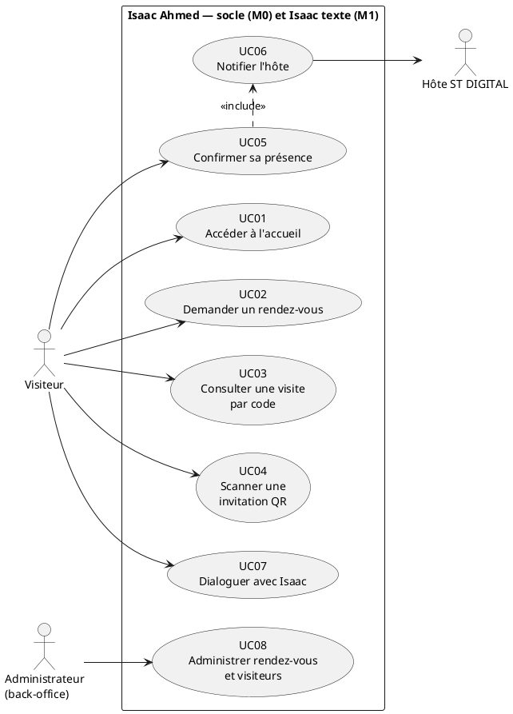

**Équivalent Mermaid** *(Mermaid n'a pas de notation UML de cas d'utilisation native ; approximation sous forme de graphe)*
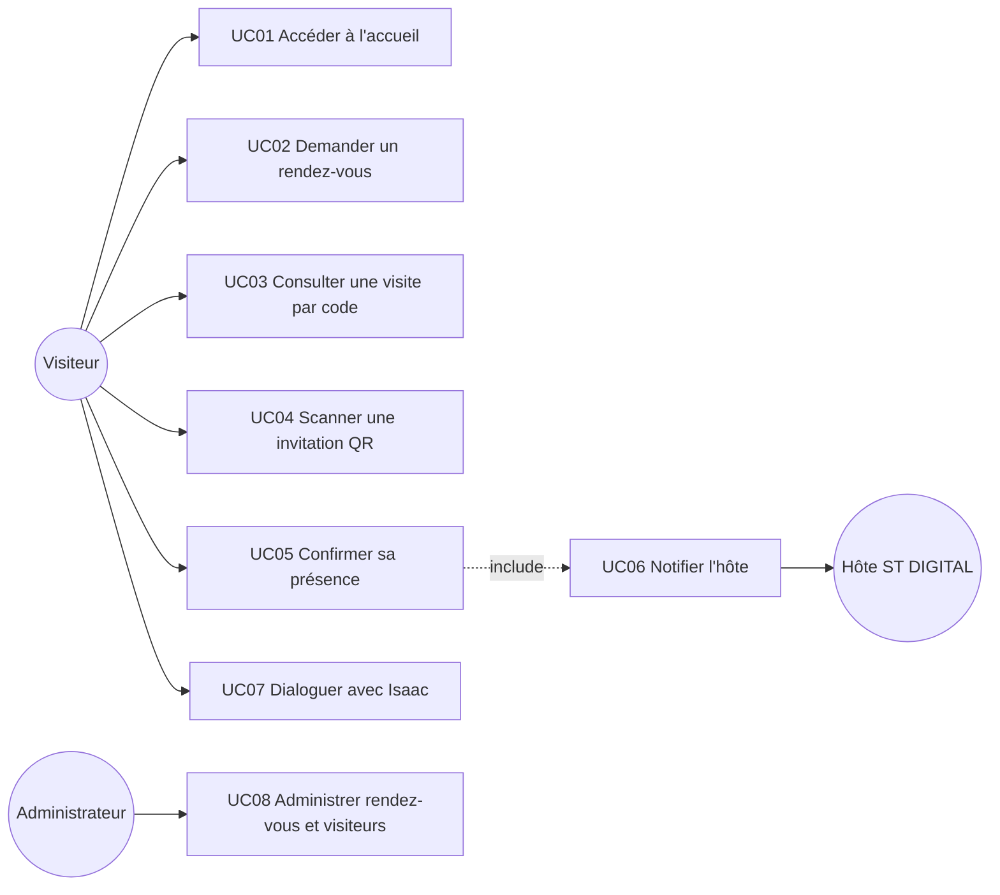

## G.2 Diagrammes de séquence

### G.2.1 Confirmation de présence et notification de l'hôte
Scénario central du projet (critère d'acceptation du Module 0 📄 : *« un scan de QR déclenche la notification de l'hôte de bout en bout »*).

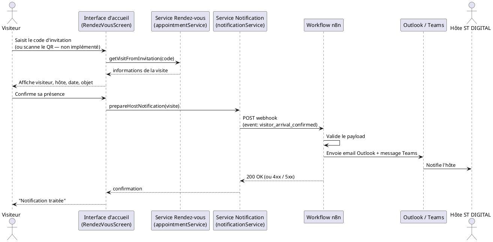

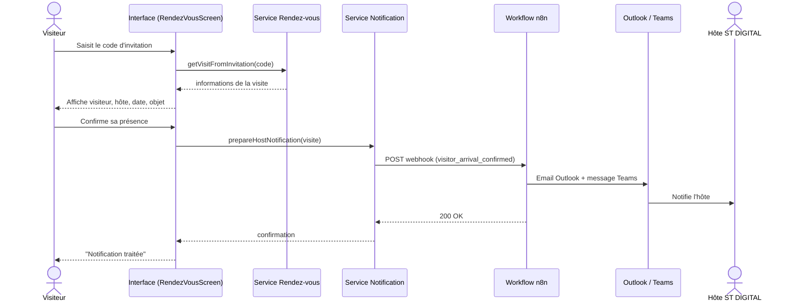

*Statut : le déroulé UI est implémenté (💻 `RendezVousScreen.js`), mais `appointmentService` et `notificationService` sont absents du dépôt — ce diagramme représente le fonctionnement **cible**, pas un flux vérifié en exécution.*

### G.2.2 Demande de rendez-vous (visiteur sans invitation)

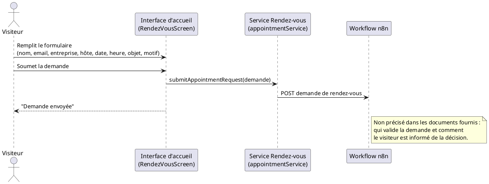

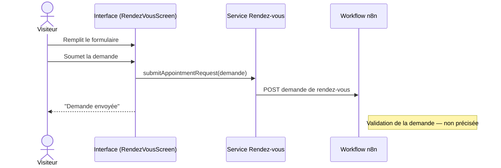

### G.2.3 Question posée à Isaac

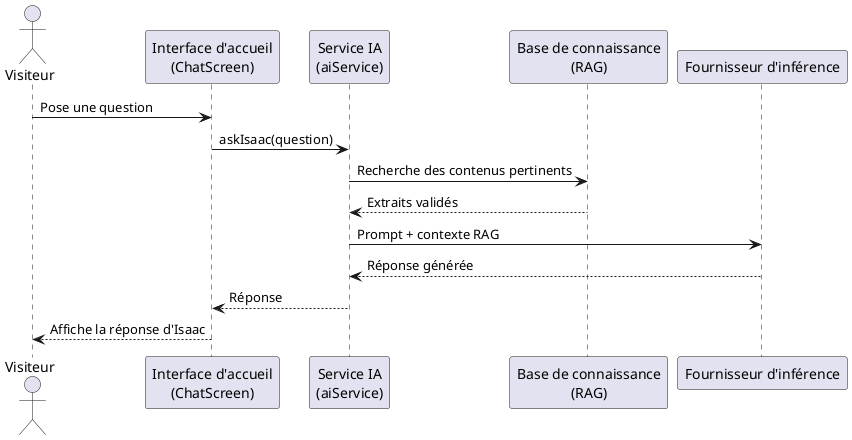

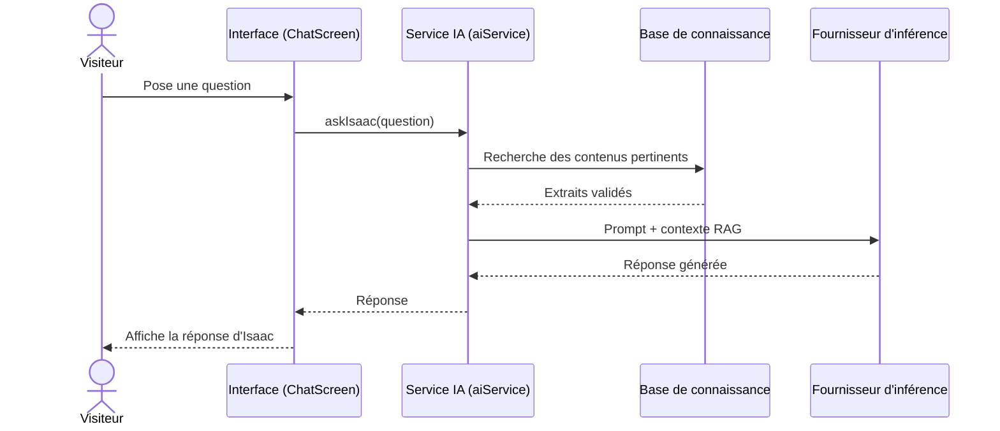

*Statut : 💡 la présence d'une base RAG et d'un fournisseur d'inférence externe est une reprise directe des objectifs 📄 (Fiche §3.1), pas une architecture observée dans le code : `aiService.js` est totalement absent du dépôt à ce jour.*

## G.3 Diagrammes d'activité

### G.3.1 Parcours de visite (reprise directe du contexte 📄 Fiche §1)

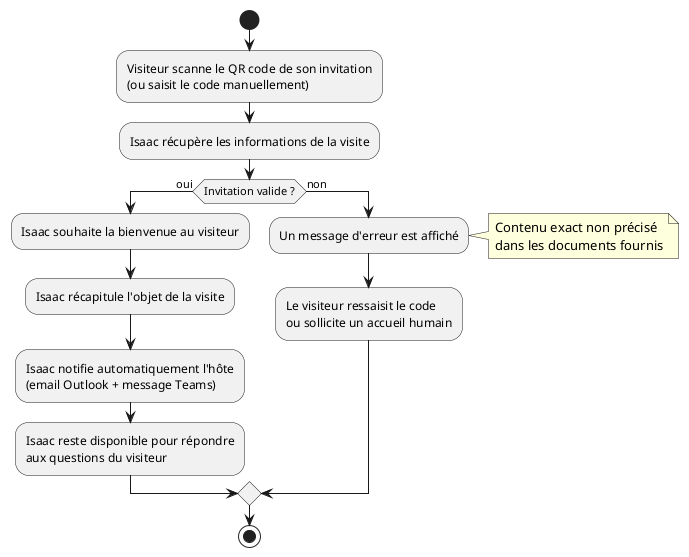

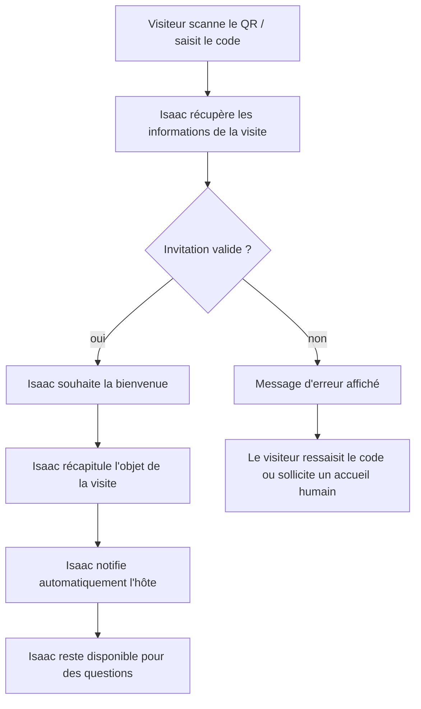

### G.3.2 Demande de rendez-vous sans invitation

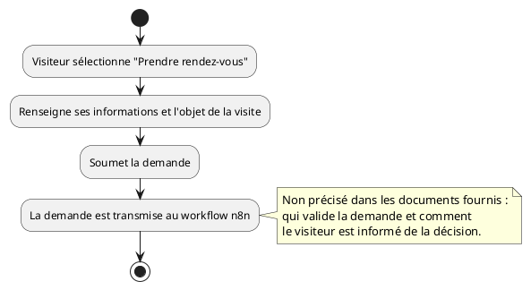

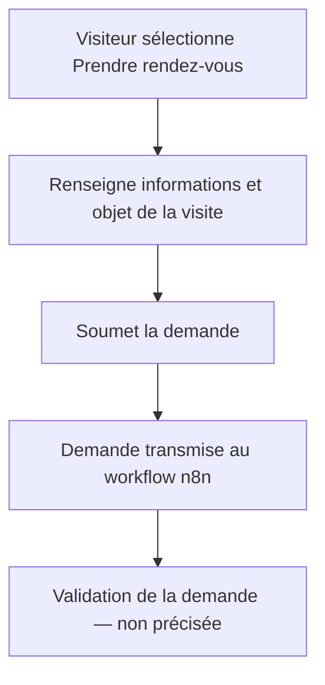

---

# PARTIE H — Modèle de données

**Principe** : seules les entités justifiées par un usage réel (mentionné dans la Fiche ou observé dans le code) sont retenues. Les entités marquées 💡 sont des propositions à faire valider par la tutrice, faute de détail dans les documents.

| Entité | Attributs | Description | Justification |
|---|---|---|---|
| **Visiteur** | nom, entreprise, email | Personne externe identifiée lors d'une visite | 📄 « base visiteurs » (Fiche §4.1 M0) |
| **Visite** | code, objet, date, heure, statut | Une visite planifiée, rattachée à une invitation | 📄 Fiche §1 (rendez-vous + carte d'invitation) + 💻 champs observés dans `RendezVousScreen.js` (`visit.code`, `visit.visitor`, `visit.company`, `visit.host`, `visit.date`, `visit.time`, `visit.purpose`) |
| **DemandeDeRendezVous** | visiteur, email, entreprise, hôte souhaité, date souhaitée, heure souhaitée, objet, motif d'accès, statut | Demande initiale avant confirmation d'un rendez-vous | 💻 champs exacts du formulaire `RendezVousScreen.js` |
| **Hôte** | nom, adresse Outlook | Collaborateur ST DIGITAL destinataire d'une notification | 💻 `docs/N8N_NOTIFICATION_CONTRACT.md` (« recherche de l'adresse Outlook de l'hôte ») |
| **Notification** | événement, canaux, statut d'envoi | Trace d'une notification envoyée pour une visite | 💻 payload documenté (`visitor_arrival_confirmed`, `["outlook","teams"]`) |
| **Document (base de connaissance)** 💡 | titre, contenu, source, date de validation | Contenu institutionnel validé alimentant le RAG d'Isaac | 📄 Fiche §3.1 (« base de connaissance interrogeable (RAG) alimentée par les contenus validés de l'entreprise ») — structure exacte non précisée |
| **Message** | expéditeur (visiteur / Isaac), texte | Échange dans la conversation avec Isaac | 💻 `App.js` (`sender`, `text`) |

**Constat important** : dans le code actuel, la conversation avec Isaac (`Message`) est un état **global et anonyme** de l'application (`App.js`), sans lien avec un `Visiteur` ou une `Visite` identifiés. Aucune relation entre `Message` et les autres entités n'est donc représentée ci-dessous — en ajouter une serait une invention, pas une observation.

**Modèle conceptuel (ER)**

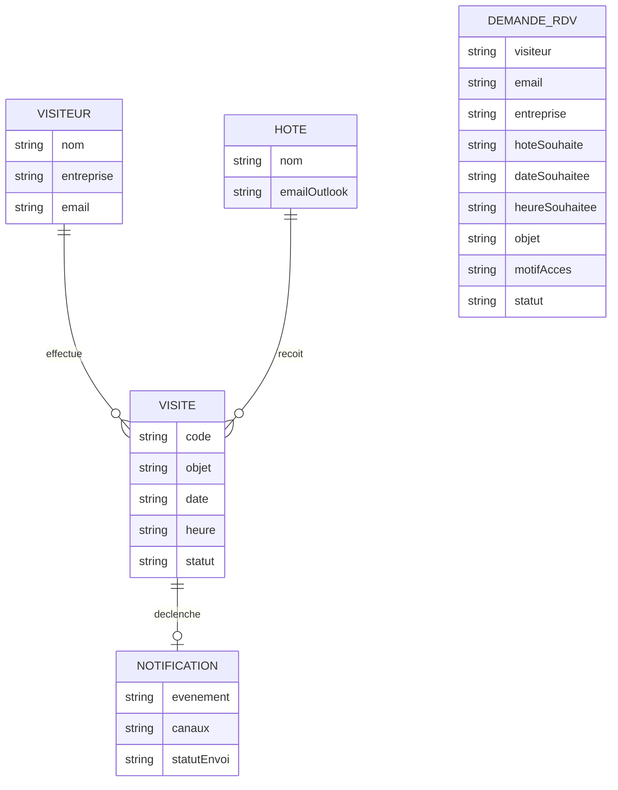

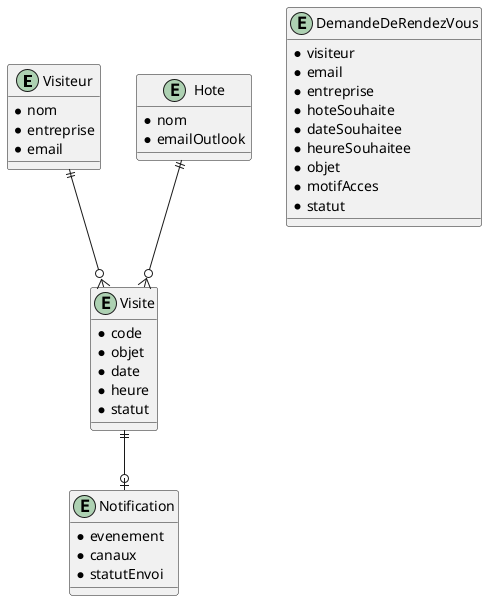

*Non précisé dans les documents fournis : le lien exact entre une `DemandeDeRendezVous` validée et la création d'une `Visite` (processus manuel via back-office ? automatique ?). Relation volontairement non représentée dans le diagramme ci-dessus.*

---

# PARTIE I — Architecture

## I.1 Architecture fonctionnelle

Reprise directe du découpage modulaire de la Fiche de stage (§4.1), aligné avec les écrans observés :

```
ISAAC AHMED — INTERFACE D'ACCUEIL
│
├── M0 — Socle
│   ├── Gestion des rendez-vous        (💻 partiel — RendezVousScreen)
│   ├── QR code (génération + scan)     (❌ à développer)
│   ├── Base visiteurs                  (❌ à développer)
│   ├── Notification de l'hôte          (💻 partiel — contrat n8n documenté)
│   └── Back-office minimal             (❌ à développer)
│
├── M1 — Isaac texte
│   ├── Noyau conversationnel           (💻 partiel — ChatScreen, aiService manquant)
│   ├── Base de connaissance (RAG)      (❌ à développer)
│   └── Interface d'accueil tactile     (💻 existant — Welcome/Home/Chat/RDV)
│
├── M2 — Audio (prototype uniquement)
│   └── Reconnaissance / synthèse vocale FR   (❌ à développer)
│
└── M3 — Vidéo / avatar (étude uniquement)
    └── Rendu visuel temps réel              (📄 étude d'architecture seulement)
```

## I.2 Architecture technique (observée dans le dépôt, pas inventée)

| Couche | Constat |
|---|---|
| **Frontend** | React 19 (`react-scripts` 5.0.1, Create React App). Écrans : `App.js` (routage par état), `WelcomeScreen`, `HomeScreen`, `RendezVousScreen`, `ChatScreen`, chacun avec son CSS dédié. |
| **Couche services** | Trois modules sont **importés mais absents du dépôt** : `src/services/aiService.js`, `src/services/appointmentService.js`, `src/services/notificationService.js` (dossier vide). *Prévu mais non implémenté.* |
| **Backend applicatif** | Non présent dans le projet actuel. Aucun serveur, aucune route API observée dans ce dépôt. |
| **Base de données** | Non présent dans le projet actuel. Aucune connexion, aucun ORM, aucun fichier de données observé (`src/data` est vide). |
| **Automatisation / notification** | Un contrat d'intégration est documenté (`docs/N8N_NOTIFICATION_CONTRACT.md`) : le frontend doit appeler un webhook n8n (`REACT_APP_N8N_NOTIFICATION_WEBHOOK`) qui orchestre l'envoi Outlook + Teams. Le workflow n8n lui-même n'est pas dans ce dépôt. Cohérent avec 📄 Fiche §7 (« instance n8n dédiée »). |
| **IA / RAG** | Prévu par les objectifs (📄 Fiche §3.1) mais non présent dans le projet actuel — aucun code, aucune dépendance IA dans `package.json`. |
| **Authentification** | Non précisé dans les documents fournis pour l'application elle-même. La Fiche mentionne un compte nominatif et un enregistrement d'application Entra ID (§7), mais dans le cadre de l'environnement de développement Microsoft 365, pas comme mécanisme d'authentification des visiteurs ou du back-office. |
| **Stockage** | Non présent dans le projet actuel. |
| **Communication externe** | Un seul point d'intégration observé : le webhook n8n via variable d'environnement, documenté et non commité (`.env.example` présent, `.env.local` ignoré). Conforme à Recueil PR-03. |
| **Configuration/secrets** | Conforme à Recueil PR-03 : `.env.example` versionné avec variables vides, `.gitignore` doit exclure `.env.local` (à vérifier explicitement dans `.gitignore`). |

---

# PARTIE J — Plan de tests et critères d'acceptation

## J.1 Plan de tests

| ID | Fonctionnalité | Précondition | Action | Résultat attendu | Résultat obtenu | Statut |
|---|---|---|---|---|---|---|
| T01 | Navigation | Application chargée | Parcourir Bienvenue → Accueil → Rendez-vous / Isaac | Chaque écran s'affiche, retour possible | Non exécuté à ce jour | À faire |
| T02 | Demande de rendez-vous | Écran Rendez-vous ouvert | Remplir et soumettre le formulaire | Écran « Demande envoyée » | Non exécuté (dépend de `appointmentService`, absent) | Bloqué |
| T03 | Consultation par code | Visite existante avec code connu | Saisir le code | Détails de la visite affichés | Non exécuté (dépend de `appointmentService`, absent) | Bloqué |
| T04 | Code invalide | — | Saisir un code inexistant | Message d'erreur approprié | Non exécuté — comportement exact non spécifié | À spécifier puis tester |
| T05 | Scan QR | Invitation avec QR valide | Scanner via la caméra | Données récupérées et affichées | Non exécuté — fonctionnalité non implémentée | Bloqué |
| T06 | QR illisible / caméra inaccessible | Recueil PR-09 | Scanner un QR abîmé / refuser l'accès caméra | Message d'erreur approprié | Non exécuté — fonctionnalité non implémentée | Bloqué |
| T07 | Confirmation de présence | Visite affichée | Cliquer « Confirmer ma présence » | Notification déclenchée, écran de confirmation | Non exécuté (dépend de `notificationService`, absent) | Bloqué |
| T08 | Notification hôte absent | Recueil PR-09 | Confirmer une présence pour un hôte injoignable | Comportement à définir | Non exécuté — comportement non spécifié | À spécifier puis tester |
| T09 | Dialogue avec Isaac | Écran Chat ouvert | Poser une question courante | Réponse pertinente affichée | Non exécuté (dépend de `aiService`, absent) | Bloqué |
| T10 | Question hors sujet | Recueil PR-09 | Poser une question sans rapport | Réponse de recadrage | Non exécuté — comportement non spécifié | À spécifier puis tester |
| T11 | Tentative de détournement de l'agent | Recueil PR-09 + ligne rouge de conception 📄 | Tenter de faire sortir Isaac de son rôle d'accueil | Isaac refuse, ne prend aucune décision de sécurité | Non exécuté — comportement non spécifié | À spécifier puis tester |
| T12 | 20 questions de référence | Corpus validé disponible | Poser les 20 questions validées par la tutrice | Toutes les réponses sont correctes | Non exécuté — jeu de questions non encore produit | À produire puis tester |

*Aucun test n'a été exécuté à ce jour : ce tableau constitue un plan prêt à l'emploi, pas un compte rendu de recette. Conforme à Recueil PR-09 (constituer le jeu de 20 questions, tester systématiquement les cas défavorables).*

## J.2 Critères d'acceptation par fonctionnalité

**Rendez-vous**
- Le formulaire refuse la soumission si un champ obligatoire est vide.
- Une demande soumise atteint le workflow n8n (à vérifier une fois `appointmentService` implémenté).

**QR Code**
- Le scanner peut accéder à la caméra.
- Un QR valide est détecté, ses données récupérées et affichées.
- Un QR invalide provoque un message approprié (Recueil PR-09).

**Notification de l'hôte**
- Un email Outlook et un message Teams sont envoyés pour toute présence confirmée.
- Le workflow répond 200 si accepté, 4xx si le payload est invalide, 5xx en cas d'échec (💻 contrat n8n).

**Assistant Isaac**
- Isaac répond correctement au jeu de 20 questions de référence validé (📄 critère d'acceptation officiel du Module 1).
- Isaac ne prend aucune décision de sécurité physique et ne s'écarte pas de son rôle d'accueil, y compris en cas de tentative de détournement (ligne rouge de conception 📄).

---

# PARTIE K — Matrice de traçabilité

| Exigence | User Story | Cas d'utilisation | Fonctionnalité | Test |
|---|---|---|---|---|
| FE-01 | US01 | UC01 | Accueil | T01 |
| FE-02 | US01 | UC01 | Accueil | T01 |
| FE-03 | US02 | UC02 | Rendez-vous | T02 |
| FE-04 | US03 | UC03 | Rendez-vous | T03, T04 |
| FE-05 | US04 | UC04 | QR Code | T05, T06 |
| FE-06 | — (à spécifier) | — | QR Code | — |
| FE-07 | — (à spécifier) | UC08 | Visiteurs | — |
| FE-08 | US05 | UC05 | Rendez-vous | T07 |
| FE-09 | US06 | UC06 | Notification | T07, T08 |
| FE-10 | US09 | UC08 | Administration | — |
| FE-11 | US07 | UC07 | Assistant Isaac | T09, T10, T11 |
| FE-12 | US08 | UC07 | Assistant Isaac | T12 |
| FE-13 | US08 | UC07 | Assistant Isaac | T12 |
| FE-14 | — (hors US détaillées, prototype) | — | Assistant Isaac (audio) | — |
| FE-15 | — (étude, pas de développement) | — | Assistant Isaac (vidéo) | — |

Les cellules « — » signalent une couverture non encore établie : soit l'exigence n'a pas de user story ou cas d'utilisation détaillé dans les documents fournis (FE-06, FE-07, FE-10), soit elle est hors engagement de développement du stage (FE-14, FE-15, cf. A.4).

---

# PARTIE L — Structure de documentation technique

Cette partie propose un sommaire ; le contenu de chaque chapitre existe déjà dans les parties précédentes de ce dossier et peut y être renvoyé directement.

1. Présentation du projet → Titre, stagiaire, tutrice, entreprise (page de garde)
2. Contexte → Partie A.1
3. Objectifs → Partie A.3
4. Périmètre → Partie A.4 / A.5
5. Besoins fonctionnels → Parties B, D, E
6. Acteurs → Partie C
7. User Stories → Partie D
8. Cas d'utilisation → Partie F
9. Architecture fonctionnelle → Partie I.1
10. Architecture technique → Partie I.2
11. Modèle de données → Partie H
12. Diagrammes UML → Partie G
13. Fonctionnement des modules → Partie I.1, croisé avec l'état d'implémentation de la Partie A.9
14. Tests → Partie J
15. Limites → Partie A.9 (constat critique sur les services manquants), Partie A.5 (hors périmètre)
16. Perspectives → Modules M2/M3 (Partie A.4), FE-06/FE-07/FE-10 non spécifiés

---

# PARTIE M — Manuel utilisateur

*Ce manuel décrit uniquement les parcours réellement présents dans l'interface aujourd'hui. Certaines étapes ne peuvent pas encore être menées jusqu'au bout car les services qui les font fonctionner ne sont pas encore présents dans le dépôt (voir avertissements ci-dessous).*

## M.1 Accéder à l'accueil
1. Ouvrir l'application : l'écran de bienvenue s'affiche, avec le logo ST DIGITAL.
2. Cliquer sur **« COMMENCER »**.
3. L'écran d'accueil central s'affiche, avec deux choix : **Rendez-vous** et **Parler à Isaac**.

## M.2 Prendre un rendez-vous (nouveau visiteur)
1. Depuis l'accueil, cliquer sur **« RENDEZ-VOUS »**.
2. Choisir **« Prendre rendez-vous »**.
3. Remplir le formulaire : nom et prénom, email, entreprise, hôte ST DIGITAL, date et heure souhaitées, objet de la visite, motif de la demande d'accès.
4. Cliquer sur **« Continuer vers Stargate »**.
5. Un écran confirme l'envoi de la demande.

⚠️ *À ce jour, la soumission dépend d'un composant (`appointmentService`) absent du dépôt : l'écran de confirmation ne reflète pas encore un envoi réellement traité.*

## M.3 Consulter une visite existante (visiteur avec invitation)
1. Depuis l'accueil, cliquer sur **« RENDEZ-VOUS »**.
2. Choisir **« J'ai un rendez-vous »**.
3. Choisir **« Saisir le code »** et entrer le code figurant sur l'invitation, ou **« Scanner le QR code »** *(non disponible à ce jour, voir avertissement)*.
4. Les informations de la visite s'affichent (visiteur, entreprise, hôte, date, objet).
5. Cliquer sur **« Confirmer ma présence »**.
6. Un écran confirme que la notification a été traitée.

⚠️ *À ce jour, le scan QR par caméra n'est pas implémenté (texte d'attente affiché à sa place) ; la consultation par code et la notification dépendent de composants (`appointmentService`, `notificationService`) absents du dépôt.*

## M.4 Interagir avec Isaac
1. Depuis l'accueil, cliquer sur **« PARLER À ISAAC »**.
2. Saisir une question dans le champ de texte.
3. Cliquer sur **« Envoyer »**.
4. La réponse d'Isaac apparaît dans la conversation.

⚠️ *À ce jour, la génération de réponse dépend d'un composant (`aiService`) absent du dépôt.*

*Non précisé dans les documents fournis / non implémenté dans le code actuel : aucun parcours d'administration (« back-office ») n'existe à ce jour — ce manuel ne peut donc pas en décrire l'usage.*

---

# PARTIE N — Éléments pour le rapport de stage

| Partie du mémoire | Ce qui peut être écrit à partir des documents et du projet |
|---|---|
| **Présentation du projet** | Reprendre 📄 Fiche §0 (intitulé, stagiaire, tutrice, entreprise, durée) et A.1 (contexte). |
| **Problématique** | Reprendre 📄 Fiche §2.2 telle quelle : découplage domaine métier / modalités / fournisseur d'inférence, en expliquant la contrainte GPU comme point de départ intellectuel, pas comme simple limitation. |
| **Objectifs** | Reprendre 📄 Fiche §3 (techniques, méthodologiques, posture professionnelle) — insister sur le fait que les objectifs méthodologiques sont évalués au même titre que les objectifs techniques (📄 Fiche §9, grille d'évaluation). |
| **Analyse des besoins** | S'appuyer sur les Parties A, B, C, D, E de ce dossier — c'est le contenu même du livrable « État de l'art et spécifications fonctionnelles » attendu fin S2. |
| **Méthodologie** | Décrire l'application effective du Recueil de procédures : journal de bord (PR-01), Git (PR-02), secrets (PR-03), cadrage de besoin (PR-04), sprints (PR-05), rituels (PR-06), procédure de blocage (PR-07). Illustrer avec des exemples réels une fois qu'ils existeront (actuellement non tenus, à documenter au fil de l'eau). |
| **Conception** | Parties F, G, H de ce dossier (cas d'utilisation, diagrammes UML, modèle de données), en particulier la justification du découplage architectural imposé par la problématique. |
| **Architecture** | Partie I — bien distinguer ce qui est observé (frontend React fonctionnel) de ce qui reste à construire (services, backend, RAG, workflow n8n). |
| **Développement** | Décrire l'écart constaté en Partie A.9 : interface complète mais couche de services absente — c'est un point de méthode intéressant à analyser dans le mémoire (pourquoi l'UI a avancé avant la logique métier, quelles conséquences). |
| **Tests** | Partie J — présenter le plan de tests comme préparé, en assumant qu'aucune recette formelle n'a encore eu lieu (📄 Recueil : « une anomalie identifiée et documentée mais non corrigée par manque de temps est un résultat acceptable et professionnel »). |
| **Résultats** | À rédiger au fur et à mesure des livraisons réelles (Fin S4 pour le Module 0, Fin S6 pour le Module 1) — ne pas anticiper de résultats non obtenus. |
| **Limites** | Modules M2/M3 non engagés en développement ferme (📄 A.4) ; absence actuelle des services `aiService`, `appointmentService`, `notificationService` (constat de code, Partie A.9) ; points non précisés par les documents (validation des demandes, back-office, réponses aux cas défavorables). |
| **Perspectives** | Bascule vers une inférence hébergée en interne (📄 problématique) ; modules M2 (audio) et M3 (vidéo/avatar) ; back-office complet ; intégration WhatsApp Business explicitement écartée pour ce stage mais envisageable ensuite. |

---

## Récapitulatif des points à faire valider en priorité par la tutrice

1. **Les trois fichiers de service manquants** (`aiService.js`, `appointmentService.js`, `notificationService.js`) empêchent l'application de fonctionner en l'état — à traiter avant toute nouvelle fonctionnalité.
2. Le **back-office minimal** (M0) n'a aucune spécification au-delà de son nom dans la Fiche de stage — à cadrer avec la tutrice (PR-04) avant développement.
3. Le comportement d'Isaac face aux **cas défavorables** (question hors sujet, tentative de détournement, hôte injoignable, invitation périmée) n'est précisé nulle part dans les documents fournis — à spécifier explicitement, en cohérence avec la ligne rouge de conception.
4. Le **jeu des 20 questions de référence** (critère d'acceptation du Module 1) reste à produire et à faire valider.
